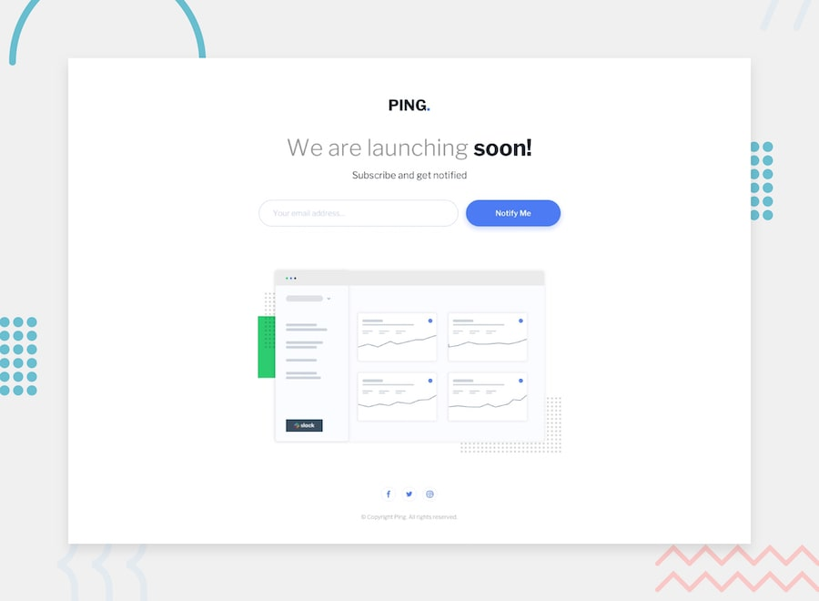

# Frontend Mentor - Ping Coming Soon Page Solution

<div align="center">


</div>

A responsive coming soon page built as part of a Frontend Mentor challenge.

This project focuses on recreating a clean and modern email subscription page using semantic HTML, CSS, and JavaScript while maintaining responsiveness and implementing custom form validation behavior.

---

## Preview



---

## Live Demo

- Live Site: [LIVE DEMO](https://juansanchezzzzz.github.io/Ping-single-column-coming-soon-page/)
- Frontend Mentor Challenge: https://www.frontendmentor.io/challenges/ping-coming-soon-page-B8TR7kgBz

---

# Overview

This project recreates the Ping Coming Soon Page design provided by Frontend Mentor.

The main objectives were:

- Semantic HTML5 structure
- Responsive layouts
- Flexbox positioning
- Form validation
- JavaScript DOM manipulation
- Email validation
- Responsive images
- Hover interactions
- Clean CSS architecture

---

# Challenges Faced

### Understanding HTML Form Validation

One of the first challenges was understanding how email validation works natively in HTML.

I learned the purpose of:

```html
<input type="email" required>
```

and how browsers automatically validate email inputs before submission.

This also led to learning about:

- `form`
- `action`
- `required`
- `type="email"`

and how native validation behaves.

---

### Learning CSS Attribute Selectors and Pseudo-Classes

Another challenge was understanding selectors such as:

```css
input[type="email"]
```

and validation states like:

```css
:valid
:invalid
```

I learned how attribute selectors target specific elements and how CSS pseudo-classes can react to different input states.

---

### Creating Custom Email Validation with JavaScript

After understanding the native browser validation, I wanted to implement the validation behavior manually using JavaScript.

This required learning:

- `querySelector()`
- `addEventListener()`
- `preventDefault()`
- `classList.add()`
- `classList.remove()`

For example:

```javascript
form.addEventListener("submit", (event) => {
    event.preventDefault();
});
```

This allowed complete control over the validation process.

---

### Validating Email Format

A significant challenge was ensuring the email matched the expected format:

```text
email@company.com
```

To achieve this, I learned how regular expressions can be used for validation:

```javascript
const emailPattern = /^[^\s@]+@[^\s@]+\.[^\s@]+$/;
```

This made it possible to reject incomplete emails and only accept properly formatted addresses.

---

### Creating Real-Time Validation

One of the most interesting parts of the project was implementing a user-friendly validation flow.

The desired behavior was:

- No error displayed initially
- Error appears after the first invalid submission
- Validation updates while typing
- Error disappears automatically when corrected
- Error reappears if the email becomes invalid again

To accomplish this, I used a submission state variable:

```javascript
let hasSubmitted = false;
```

which allowed validation to become reactive only after the first submit attempt.

---

### Displaying Error Messages Without Breaking the Layout

A challenge appeared when showing the error message below the input field.

Initially, displaying the message caused the entire layout to shift downward.

I learned how document flow works and how different CSS properties affect layout behavior.

The final solution reserved space for the message from the start using:

```css
visibility: hidden;
```

instead of:

```css
display: none;
```

which prevented unwanted layout movement.

---

### Working with Flexbox and Form Alignment

The email field and button needed to remain aligned on desktop while stacking correctly on mobile devices.

This required careful use of:

```css
display: flex;
```

along with:

```css
align-items: flex-start;
```

and responsive media queries.

Understanding how Flexbox distributes space helped create a more stable layout.

---

### Responsive Form Sizing

Another challenge involved making the input field and button match widths correctly on smaller screens.

The issue came from fixed widths overriding the container dimensions.

This was solved by using:

```css
width: 100%;
```

inside the mobile breakpoint while allowing the parent container to control the available space.

---

### Managing Input Focus States

While implementing validation, I discovered that browsers apply their own focus styles when an input is selected.

This caused the red error border to disappear temporarily.

The issue was solved by customizing:

```css
input:focus
```

and removing the default outline:

```css
outline: none;
```

which allowed the custom validation styling to remain visible.

---

### Organizing CSS More Effectively

As the stylesheet grew, it became harder to find specific rules.

I learned the importance of grouping styles into sections such as:

- Variables
- Reset
- Layout
- Typography
- Forms
- Components
- Validation
- Responsive styles

This made the code significantly easier to maintain.

---

# Built With

- HTML5
- CSS3
- JavaScript (ES6)
- Flexbox
- CSS Custom Properties
- Responsive Design
- Form Validation
- Regular Expressions (Regex)
- DOM Manipulation
- CSS Transitions

---

# Responsive Design Approach

The page was designed using a responsive-first mindset.

Desktop devices display:

- Logo
- Hero content
- Email subscription form
- Dashboard illustration
- Social media links

Mobile devices adjust:

- Form layout
- Input widths
- Button sizing
- Dashboard scaling
- Overall spacing

```css
@media (max-width: 39rem) {
    form {
        flex-direction: column;
    }
}
```

This allows the interface to remain usable across different screen sizes.

---

# What I Learned

Through this project I gained more experience with:

- Building responsive landing pages from design mockups
- Creating accessible HTML forms
- Understanding the purpose of the `form` element
- Using `type="email"` and `required`
- Working with CSS attribute selectors
- Understanding pseudo-classes such as `:valid`, `:invalid`, and `:focus`
- Using `querySelector()` to select DOM elements
- Handling events with `addEventListener()`
- Preventing default form behavior with `preventDefault()`
- Adding and removing classes dynamically
- Performing email validation using regular expressions
- Creating real-time validation feedback
- Managing validation states after form submission
- Displaying and hiding error messages dynamically
- Understanding document flow and layout shifts
- Using `visibility` versus `display`
- Working with Flexbox layouts
- Building responsive forms
- Controlling input focus styles
- Using relative units such as `rem`
- Organizing CSS into logical sections
- Creating smoother user interactions through CSS transitions

---

# Author

- Frontend Mentor - https://www.frontendmentor.io/profile/juansanchezzzzz
- GitHub - https://github.com/juansanchezzzzz
